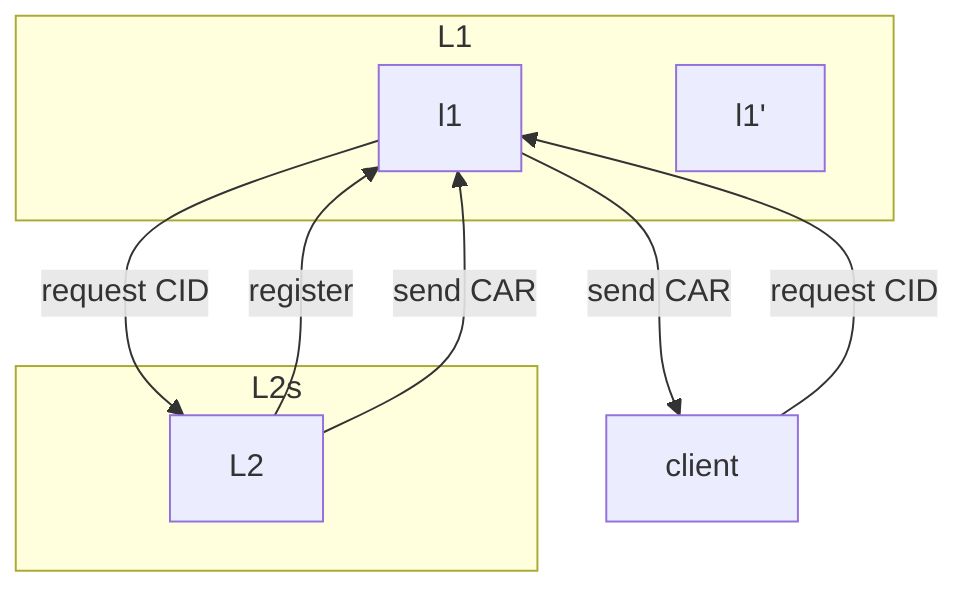

# test-markdown

```



```
Click below to **learn more** in a video:

[][youtube_demo]

[youtube_demo]: https://www.youtube.com/watch?v=IPSbNdBmWKE
```

Click below to **learn more** in a video:

[][youtube_demo]

[youtube_demo]: https://www.youtube.com/watch?v=IPSbNdBmWKE

```
## Test


### 1.1

1. This Is Left Content!

### 1.2

2. This Is Left Content!

### 1.3

3. This Is Left Content!
```

## Test


### 1.1

1. This Is Left Content!

### 1.2

2. This Is Left Content!

### 1.3

3. This Is Left Content!


https://github.com/labring/sealos/assets/82700206/b1f8a25a-55cf-4d15-a47b-38cf7d507134

```
## 添加视频
https://github.com/labring/sealos/assets/82700206/b1f8a25a-55cf-4d15-a47b-38cf7d507134
```
