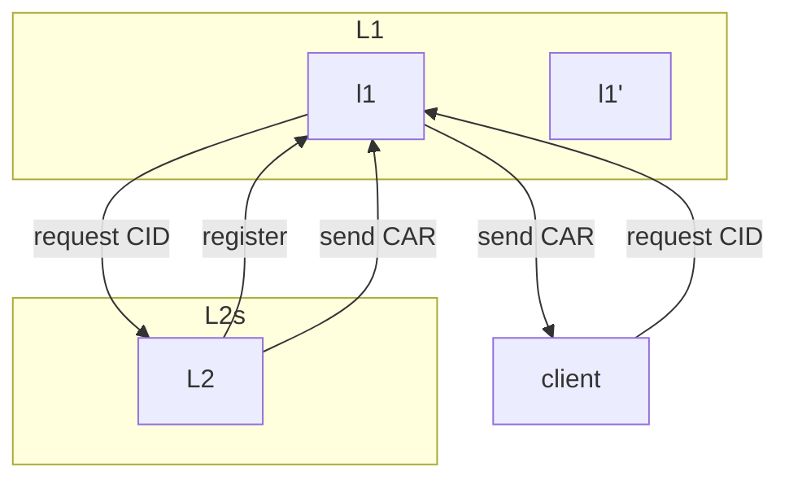

# test-markdown

```

``` mermaid
flowchart TB
  subgraph L1
    l1
    l1'
  end
  subgraph L2s
    L2
  end
  L2 -->|register|l1
  l1 --> |request CID|L2
  L2 --> |send CAR|l1
  client --> |request CID|l1
  l1 --> |send CAR|client
```


```mermaid
flowchart TB
  subgraph L1
    l1
    l1'
  end
  subgraph L2s
    L2
  end
  L2 -->|register|l1
  l1 --> |request CID|L2
  L2 --> |send CAR|l1
  client --> |request CID|l1
  l1 --> |send CAR|client
```


Click below to **learn more** in a video:

[][youtube_demo]

[youtube_demo]: https://www.youtube.com/watch?v=IPSbNdBmWKE
